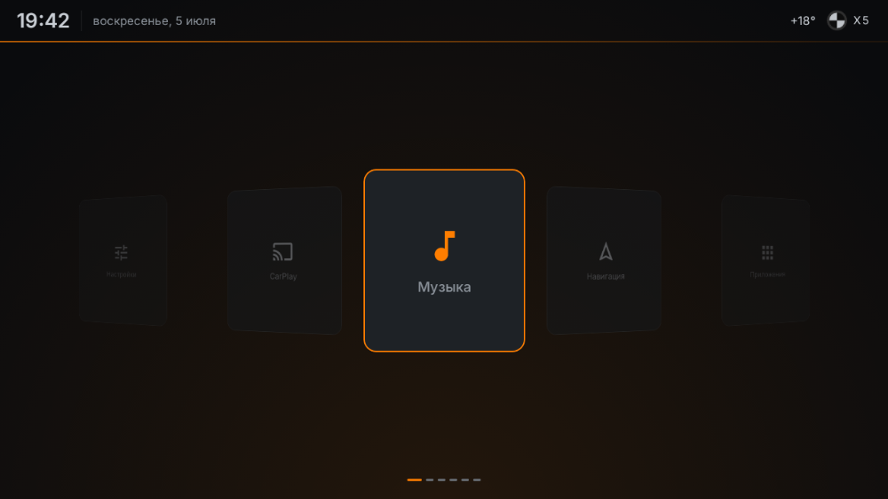
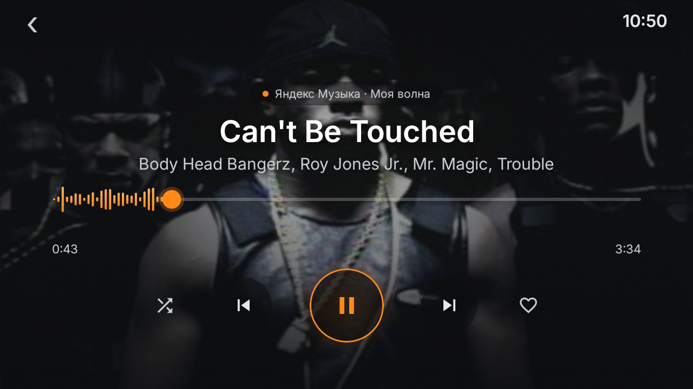
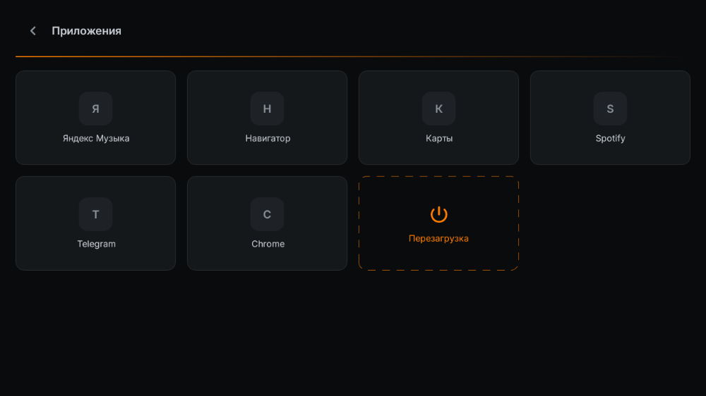
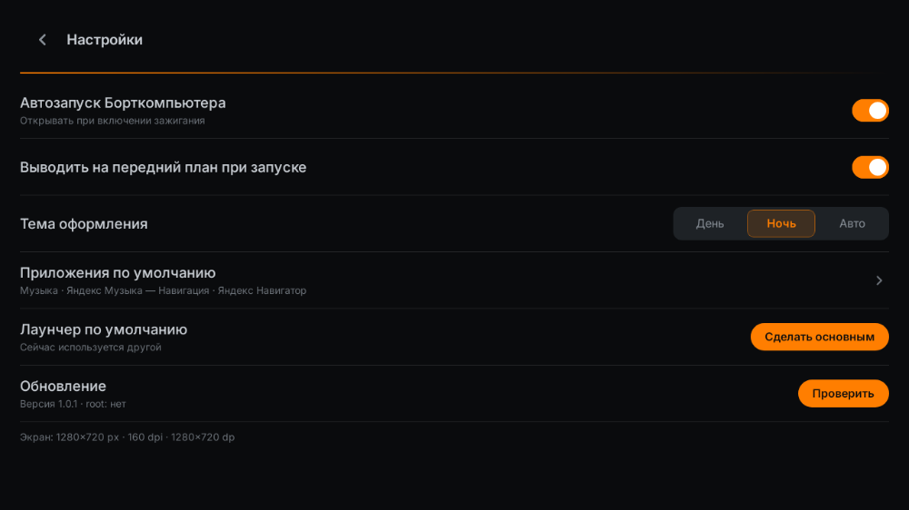

# BMW iDrive Launcher

**English** · [Русский](README.ru.md)

**A custom Android home-screen launcher that turns a cheap aftermarket head unit into a premium, BMW-iDrive-style car interface.**

Built for a **2005 BMW X5 (E53)** running an **XTRONS** Android head unit, this launcher replaces the sluggish factory desktop with a fast, touch-first UI inspired by modern **iDrive**: a 3D tile carousel over a **live map background**, an instrument-amber accent on near-black graphite, a now-playing screen wired to **Yandex Music**, and a **from-scratch on-board computer that reads the car's BMW I-Bus directly over USB** (it also folds the mirrors) — plus in-app OTA updates, one-tap reboot, and diagnostics that watch the launcher and repair it. All in **Kotlin + Jetpack Compose**, screenshot-tested, no root required.

<p align="center">
  
</p>

---

## Table of contents

- [Why](#why)
- [Screenshots](#screenshots)
- [Features](#features)
- [The car & the head unit](#the-car--the-head-unit)
- [Design system](#design-system)
- [Architecture](#architecture)
- [Project structure](#project-structure)
- [Build & run](#build--run)
- [Testing](#testing)
- [Over-the-air updates](#over-the-air-updates)
- [Version history](#version-history)
- [Roadmap](#roadmap)
- [Known limitations](#known-limitations)
- [Tech stack](#tech-stack)
- [Credits & license](#credits--license)

---

## Why

The factory launcher shipped on these XTRONS units (an abandoned third-party "iDrive Launcher") is laggy and unmaintained.

This started as a from-scratch replacement whose main job was to **autostart a proprietary third-party i-Bus app** (the car's trip computer) and get out of the way. It has since grown into a full stack: the launcher now **reads the car's I-Bus itself** over the Resler USB adapter — so that third-party app is **gone entirely** — and renders a fast, glanceable home you can operate at 70–90 cm while driving.

**Design goals**

- **Fast & responsive** — no jank on a low-end Qualcomm SoC.
- **Touch-first** — the E53 has no rotary controller, only the XTRONS touchscreen.
- **BMW surface language** — instrument-illumination amber on graphite, iDrive-style depth.
- **Own the whole stack** — trip computer, updates, reboot — so nothing depends on an abandoned third-party app, and it can all be improved over the air without a flash drive.

---

## Screenshots

> These are the app's actual rendered UI, captured by the [Paparazzi](https://github.com/cashapp/paparazzi) screenshot tests at the head unit's native 1280×720.

| Home — iDrive 3D carousel (over a live map) | Music — player v4 (cover bg + calm seek bar) |
|---|---|
|  |  |

| Apps | Settings |
|---|---|
|  |  |

---

## Features

### Home — a looping 3D tile carousel
- An **infinitely-looping, cylindrical 3D carousel** of large tiles (iDrive-2016 style): the centered tile is flat, focused, amber-bordered and glowing; side tiles turn away in perspective, shrink, and dim.
- **Icon-dominant** filled graphite cards; whole-tile tap.
- The 3D "feel" is driven entirely by a pure, unit-tested `CarouselGeometry` — rotation / scale / opacity per position — so it's tunable and re-shippable over the air without touching Compose.
- A **status ribbon** (clock · full Russian date · **live outside temperature read from the car's I-Bus**) and a breathing **amber ambient glow**.
- **Page-indicator strips** that scale to any number of tiles.
- The carousel floats over a **live map background** (see below).

### Live map background
- The home screen sits over a **live map that follows the car's GPS** — a near-monochrome graphite canvas with no labels, where **roads read by hierarchy** (alleys almost vanish, motorways get one muted warm line) so the map recedes and the amber stays the UI's. The first cut was the opposite — every road in one saturated amber — and it fought the interface.
- Rendered by **MapLibre GL** from free **OpenFreeMap** vector tiles — **no API key, no Google Play Services**. The **style is a JSON file hosted on our own server**, so colours are re-tuned without shipping a new build.
- Tiles are **proxied through our own host** (the head unit's ISP can't reach the tile CDN directly, but it can always reach our server), and a dark scrim keeps the tiles/clock legible over the map. Gestures are disabled — it's a backdrop, not a map you touch.
- **One map view for the whole process**, composed below the navigation graph rather than inside the home screen: leaving the carousel used to destroy its GL context and returning built a new one, dozens of times per drive (see [field notes](#field-notes--problems-solved)).

### Music — Yandex Music now-playing (player screen v4)
- Controls **Yandex Music** via the Android `MediaSession` / `MediaController` framework (no reverse-engineering) using a `NotificationListenerService`.
- **v4 player screen:** the **album cover fills the whole background** (scrim + vignette keep text legible); a **calm amber seek bar** shows progress. Transport row is *shuffle · prev · play/pause · next · like*, with a tap-and-drag seek. *(An earlier animated "equalizer" was dropped: the head-unit ROM blocks audio capture, so any analyzer was necessarily synthetic and read as fake.)*
- **Reliable cold-start:** opening Music auto-wakes Yandex; if a fully-killed app won't resume in the background, an explicit **"Включить музыку"** button foreground-launches it so «Моя волна» starts, then drops you back on the now-playing screen.

### Video — YouTube behind a per-app VPN, plus ivi
- A **YouTube** tile that opens the app, and an **ivi** tile beside it (it tries the phone build and the Android-TV one and launches whichever is installed). YouTube is throttled/blocked in Russia, so it runs behind a **DPI-bypassing VPN** (VLESS + Reality via [sing-box](https://sing-box.sagernet.org/)) configured as an **always-on, _per-app_ `VpnService`** — only YouTube's traffic egresses through the tunnel; everything else (Yandex, navigation) stays direct. No runtime root needed. Design: [`youtube-vpn-design.md`](docs/superpowers/specs/2026-07-06-youtube-vpn-design.md).

### On-board computer — reads the car's I-Bus directly
- A **from-scratch trip computer**: the launcher talks to the car's **BMW I-Bus** over the Resler **CP210x USB-serial** adapter (9600 8E1, via `usb-serial-for-android`) and decodes the IKE instrument-cluster broadcasts itself — **speed, RPM, coolant & outside temperature, ignition** — and shows them on a native screen in the launcher's own style.
- **Trip average speed** on top of that: a pure, unit-tested `TripStats` integrates speed over time (stops included, the way a real trip average works), with its own reset.
- **The adapter recovers itself.** The USB link drops occasionally on this unit; the reader detaches, retries with a backoff and reconnects without touching the app.
- The I-Bus framing + decode is a **pure, unit-tested** `IBusDecoder`; a single **process-wide reader** feeds both the trip-computer screen and the **live outside-temperature** in the home status bar (the BC opens already connected).
- This **replaced** the old approach of autostarting a proprietary i-Bus app, which was flaky and fought over the single-owner USB port. That app is **uninstalled** — we own the adapter. The reader logs one example of every distinct bus message type, so new gauges (fuel, consumption, trip averages) can be decoded from a real drive.
- Everything USB is **guarded** — no adapter / no permission just shows a "no adapter" state; the HOME app must never crash.

### Mirrors that fold themselves
- The door mirrors **fold when the ignition goes off and unfold when it comes back on**, driven by the same I-Bus link (optional, off by default).
- It is tied to the **ignition, not the door lock**, for a physical reason: the head unit is powered from the ignition and dies within seconds of switching off, so nothing of ours is listening while the car sits locked. Automation that can only run while the unit has power must hang off the event that *is* the power.
- The codes were **read off the car**, not guessed. An earlier guess (`0x31`/`0x30`) turned out to drive the **windows**, which is exactly why the next feature exists.

### Bus recorder & probe
- A **read-only recorder** logs one timestamped example of every distinct I-Bus message type seen on a drive — that capture is how new values get decoded (fuel and consumption are next), and how the parking module's distances (device `0x60`) are being worked out.
- A **probe screen** sends a chosen telegram from a small catalogue and shows what comes back, so a candidate command is tried deliberately, once, instead of being shipped on a hunch.
- The reader writes to the bus only for the features that need it: folding the mirrors, and one telegram that clears the latched OBC speed limit (see field notes). Everything else is listening.

### Diagnostics that survive the car
- The launcher watches itself: a crash handler, an **ANR watchdog** (main-looper ping + full thread dump), and a **black-screen detector** that samples the window's own pixels — the failure where the window goes black while the main thread stays perfectly responsive, so nothing else notices it.
- Reports are **written to disk first and uploaded second**, because the interesting failures happen where there may be no network and the driver may just switch the ignition off. Each report carries device state, an event log, a logcat tail and a thread dump.
- The black-screen detector doesn't only report — it **repairs, one step at a time** (drop the map → recreate the activity → restart the process), waits to see whether each step worked, and records the one that brought the pixels back. That answer is what tells us which layer broke.

### Apps drawer
- A grid of installed apps (real launcher icons from `PackageManager`) plus a dedicated, cordoned-off **Reboot** tile (tap-to-confirm).

### Settings
- **Day / Night / Auto** theme segment control, **default-app** display, a **"Make default launcher"** action, the **in-app updater**, the **mirror-fold** switch, the **bus recorder**, and one-tap **diagnostic-log upload**.

### Reboot without root
- Reboots this Microntek/HCT ROM via a vendor broadcast (`com.microntek.hctreboot`) — confirmed working from an unprivileged app, no `su` needed.

### Over-the-air self-update
- Checks a JSON manifest, and installs new builds either silently (if root is ever present) or via the system installer (non-root) — see [OTA](#over-the-air-updates).

---

## The car & the head unit

| | |
|---|---|
| **Car** | BMW X5 **E53** (2005) |
| **Head unit** | XTRONS IQ7439BL |
| **ROM** | Microntek / HCT, **Android 13** |
| **SoC** | Qualcomm QCM6125 |
| **Root** | **No** (the entire app is designed to be non-root) |
| **Screen** | 1280×720 px, landscape, capacitive touch (no rotary encoder). At the stock 240 dpi that is **853 dp** wide; the display-size setting moves it (the unit currently reports 204 dpi → **1003 dp**), so nothing may assume a fixed dp width |
| **Car integration** | our own I-Bus reader over the Resler **CP210x USB→I-Bus** adapter |

> **Design note:** everything is laid out in **dp** against the *measured* width, never a hardcoded one — an early bug centred the carousel off-screen because the layout math assumed 1280 dp. Screenshot tests deliberately render at 1280 px / mdpi (so `dp == px`) to pin the layout to the mockups.

---

## Enabling ADB on these head units — the `adbon` password

Developing on this class of unit has one nasty gotcha: the normal *"tap Build number 7×"* trick **does nothing**, and *Developer Options* never appears — the About screen only exposes an MCU version like **`if2 - V2`**. The undocumented fix is to open the unit's **Factory Settings** and type **`adbon`** as the password, which unlocks Developer Options / ADB. From there, **Wireless debugging** works with no USB cable, and because the ROM is a `userdebug` build, **`adb root` works**.

It took a full evening to reverse-engineer, so it's written up as a standalone guide for anyone with a **XTRONS / Microntek / HCT / MTCE** unit:

📄 **[Enabling ADB / Developer Options on Chinese Android head units (`adbon`)](docs/ENABLING-ADB-HCT-HEADUNITS.md)**

---

## Design system

The visual language is a curated "night-calm" automotive theme — **authentic BMW instrument-illumination amber `#FF7E00`** dosed over near-black graphite, matte (no gloss/glass — glare kills it in a car).

**Color tokens (night)**

| Token | Value | Use |
|---|---|---|
| `bgBase` | `#0A0B0D` | screen background |
| `surface` | `#15181B` | card fill |
| `surfaceHi` | `#1E2226` | pressed / focused fill |
| `textPrimary` | `#C7CCD2` | primary text (never pure white — glare) |
| `textSecondary` | `#8A9199` | secondary text |
| `accentAmber` | `#FF7E00` | the one accent |

- **Typography:** **Inter** (400/500/600/700), tabular figures. *(The design handoff specified Archivo, but Archivo has no Cyrillic — the UI is Russian — so Inter was substituted.)*
- **Interaction:** every tap gets a "triple pressed signal" — scale down + amber border + fill lift — plus haptics, because on a car screen you must **see and feel** that a press registered.
- **Motion:** carousel spring-snap, breathing ambient glow, no gratuitous animation.

Design references (rendered mockups + full token spec) live in [`docs/mockups/`](docs/mockups/).

---

## Architecture

Plain **Kotlin + Jetpack Compose**, no DI framework, small and legible. Logic that *can* be pure and unit-tested *is* (geometry, time formatting, playback mapping, theme resolution); Compose UI is verified with screenshot goldens.

```
HomeActivity (single Compose Activity, declared as HOME)
 ├─ MapBackground (MapLibre)          — one map view, BELOW the NavHost
 ├─ NavHost: home · music · apps · settings · bordcomputer · busprobe
 ├─ SettingsStore (DataStore)         — persisted prefs
 ├─ AppLauncher / InstalledApps       — launch + enumerate apps
 ├─ RootShell / ShellCommands         — root-adaptive (works without root)
 ├─ car/    IBusDecoder (pure, unit-tested) · IBusReader (CP210x USB) ·
 │          IBusService (process-wide singleton) · BordData · TripStats (pure) ·
 │          MirrorTelegrams · BusProbeCatalog · ButtonRedirectService
 ├─ diag/   AppLog · CrashHandler · AnrWatchdog ·
 │          BlackScreenWatchdog + BlackScreenPolicy (pure) · LogUploader
 ├─ update/ (UpdateChecker, ApkDownloader, ApkInstaller, RootDetector)
 └─ music/ (MediaSessionRepository, MusicController, MusicViewModel,
            MediaNotificationListener, PlaybackMapper, NowPlaying)
ui/
 ├─ home/   CarouselGeometry · HomeCarousel · TileCard · StatusRibbon ·
 │          RibbonClock · AmbientGlow · PageIndicator · MapBackground · MapRuntime
 ├─ bordcomputer/ BordComputerScreen
 ├─ probe/  BusProbeScreen
 ├─ apps/   AppsScreen
 ├─ settings/ SettingsScreen
 └─ theme/  Color · Theme · Type · Pressable · ScreenHeader
```

**Principles**

- Tunable constants (carousel angles, sizes, glow) live in pure objects so the "feel" is adjustable and OTA-shippable without editing view code.
- Everything degrades gracefully with no root and no network.
- The launcher is the HOME app — it **must never crash**; external intents are all guarded.

---

## Project structure

```
app/                     Android app module (Kotlin/Compose)
  src/main/…             source + AndroidManifest + res (adaptive icon, Inter fonts)
  src/test/…             JUnit + Robolectric unit tests + Paparazzi screenshot tests
docs/mockups/            design references (rendered screens + token spec)
scripts/release.sh       build signed release + publish OTA manifest
screenshots/             the images used in this README
```

---

## Build & run

**Requirements:** JDK 17, Android SDK (compileSdk 34), Gradle (wrapper included).

```bash
export JAVA_HOME=/path/to/jdk-17
export ANDROID_SDK_ROOT=/path/to/android-sdk

# debug APK
./gradlew :app:assembleDebug

# unit tests + screenshot verification
./gradlew :app:testDebugUnitTest :app:verifyPaparazziDebug
```

- `applicationId` = `online.k73.bmwlauncher` · `minSdk` 26 · `targetSdk` 33 · `compileSdk` 34.
- **Release signing** reads `keystore.properties` (gitignored) — create your own keystore; the app is unsigned-debug out of the box.

Install on the head unit over ADB (or via the in-app updater):

```bash
adb install -r app/build/outputs/apk/debug/app-debug.apk
```

Then set it as the default Home app (Android Settings → Default apps → Home app).

---

## Testing

- **Unit tests** (JUnit4 + Robolectric) cover the pure logic: carousel geometry, clock/date formatting, playback mapping, theme resolution, the update checker, and the autostart state machine.
- **Screenshot tests** ([Paparazzi](https://github.com/cashapp/paparazzi)) render each screen at the head unit's 1280×720 and diff against committed goldens, so a visual regression fails CI. The goldens double as the screenshots in this README.
- Two rules learned the hard way: `testDebugUnitTest` **records** goldens, only `verifyPaparazziDebug` **checks** them — so "tests pass" is not "screens unchanged"; and any non-deterministic value on a screen (a live clock) must be injectable, or its golden can never verify again.

```bash
./gradlew :app:recordPaparazziDebug   # regenerate goldens
./gradlew :app:verifyPaparazziDebug   # verify against goldens
```

---

## Over-the-air updates

The app self-updates so improvements ship without a flash drive:

1. **Settings → Update → "Check"** fetches a JSON manifest (`latest.json`) describing the newest build.
2. If newer, the button becomes **"Update"** and installs it:
   - **with root** (if ever present): silent `pm install -r` + relaunch,
   - **without root** (the norm here): download + system-installer intent via a `FileProvider`.

`scripts/release.sh` builds the signed release, uploads the APK, and writes the manifest. (The script's upload target is environment-specific — point it at your own host.)

---

## Version history

| Version | Highlights |
|---|---|
| **1.6.39** | **One map for the whole process** — the MapLibre view moved out of the home destination and under the NavHost, so leaving the carousel no longer destroys its GL context and returning no longer builds a new one (it used to happen dozens of times per drive, and the first captured black screen landed right after such a rebuild). Screenshot goldens made honest again: the Settings one was missing two rows, and the Music ones rendered a live clock, so they could never verify |
| **1.6.38** | **Black screen heals itself** — the detector now escalates through drop-the-map → recreate the activity → restart the process, and records which step brought the pixels back; its report gained a logcat tail, a GPU-bypassing software draw of the same window, a frame counter and the map's GL-context churn, so one occurrence is enough to name the broken layer |
| **1.6.32–1.6.37** | **Real mirror fold codes** (0x39/0x3A — the earlier guess drove the *windows*), folding tied to the ignition rather than the door lock, a **bus probe** screen for trying telegrams safely, and an **ivi** tile beside YouTube |
| **1.6.31** | **Durable black-screen detector** — samples the window's own pixels, so the blank-window-with-a-live-main-thread failure finally leaves evidence even when the car is offline |
| **1.6.21–1.6.30** | HOME key always returns to the carousel and Back on the carousel stays put; PDC capture with live counters; **mirror automation** (first attempt); I-Bus **reconnects itself** after a USB drop; read-only **bus recorder** with timestamped frames |
| **1.6.15–1.6.20** | Denser & bigger iDrive carousel; **reliable Back on every screen** (+ the hardware Back key, the only real panel key); **panel "Music" button → our own player** via an AccessibilityService redirect; **trip average speed** in the on-board computer (with reset); **PDC capture** — polls the parking module on the I-Bus to decode its distances |
| **1.6.11–1.6.14** | Map rendered as a **TextureView** (fixes the black home screen after an ACC sleep/wake); one-tap **clear of the latched OBC speed limit** (the >6 km/h gong); hardware key-event logging; headless Yandex start (no app flash) |
| **1.6.10** | On-board computer logs one example of **every distinct I-Bus message type** — groundwork for fuel / consumption / trip averages |
| **1.6.9** | **Live outside temperature** on the home status bar (replaces the X5 emblem); one shared process-wide I-Bus reader |
| **1.6.6–1.6.8** | **Own on-board computer** — reads the BMW I-Bus over the CP210x USB adapter (speed · RPM · coolant · outside temp); i-Bus app autostart removed; map tiles proxied through our own host |
| **1.6.3–1.6.7** | **Live map home background** — MapLibre GL + OpenFreeMap, self-styled dark/amber (dropped Yandex MapKit, whose proprietary style format never applied) |
| **1.6.0–1.6.2** | Audio-reactive equalizer experiments → **removed** for a calm seek bar (ROM blocks audio capture); reboot-durable ANR reports; gray-screen root-cause fixes |
| **1.5.7** | **YouTube tile** (opens behind a per-app DPI-bypassing VPN, provisioned on-device) |
| **1.5.6** | **Player screen v4** — album cover background + **live amber equalizer** progress, new shuffle·prev·play·next·like transport |
| **1.5.5** | Reliable Yandex **cold-start** — auto-wake on entry, bounded nudges, foreground fallback |
| **1.5.0–1.5.4** | In-app diagnostics (event log, crash/ANR capture, one-tap upload), cold-start polish, grey-empty-Music fix |
| **1.4.x** | **Claude-Design redesign** — filled icon-centric carousel cards, envelope album art, working back navigation, reliable "make default launcher", darker palette + Inter typography, triple press-feedback |
| **1.3.x** | iDrive 3D carousel home + on-device tuning (centering on real width, size, contrast) |
| **1.2.x** | Adaptive launcher icon, default-launcher setting, Music seek + like, i-Bus flash removal |
| **1.1.x** | Music now-playing (Yandex `MediaSession`) |
| **1.0.x** | Skeleton launcher, non-root reboot, OTA self-update, autostart |

---

## Roadmap

- **Trip computer** — fuel level and consumption, decoded from a real drive capture (average speed is done).
- **An earlier parking alert** — the E53's own buzzer stays quiet until you are close; the distances are on the bus, so a graduated alert can start sooner.
- In-launcher **playlist browsing** (Yandex `MediaBrowserService`, pending device probe).
- Reflect the **real "liked" state** from the media session.
- A distinct, brighter **Day theme** pass.

*(Done since the roadmap was first written: live map background, our own I-Bus on-board computer, outside temperature in the ribbon, trip average speed, mirror automation, self-repairing diagnostics.)*

---

## Field notes — problems solved

Developing a launcher for a Chinese Qualcomm head unit, blind, on a real daily-driven car surfaces problems you won't find in the docs. The notable ones:

- **Recovering the unit from a boot-loop brick.** A one-time root experiment flashed a Magisk-patched `boot_b` that kernel-panics on this engineering ROM → an endless *logo → black screen* loop that A/B auto-rollback never escaped. The vendor's recovery steps (a "reset button" menu, a USB stick) are for Rockchip units and do nothing on Qualcomm. The real fix: reach **fastboot over the 4-pin USB‑OTG lead** (see below) and re-flash the unit's own stock boot image (`fastboot flash boot_b …`). Data, apps and settings all survived (userdata is shared across A/B slots).
- **Which USB port is which.** These units expose three USB channels: a **6-pin lead = USB2 + USB3 (host-only**, for flash drives) and a **4-pin lead = USB_OTG** (the service port). Only the OTG lead enumerates as **fastboot / EDL 9008** on a PC — every recovery attempt on the host ports sees nothing. Reset-power on the OTG lead lands in *fastboot* (`Android Bootloader Interface`, 18D1:D00D), not EDL.
- **The panel hardware buttons can't be remapped — but can be redirected.** A live `getevent` capture proved only **«Back» sends a real key code** (`KEY_BACK`); every other panel button is hard-wired inside the MCU to `startActivity` a stock Microntek app, emitting no interceptable key event. So we can't hook the key — instead an **AccessibilityService** catches the stock app coming to the foreground and jumps to our matching screen (e.g. the panel "Music" button now opens our player).
- **Tiny tap targets don't register on this LCD.** Small back chevrons near the very top edge were frequently missed; enlarging them and adding a hardware `BackHandler` on every screen fixed both the touch and the physical Back key.
- **The grey player.** Yandex Music exposes *several* `MediaSession`s — an idle blank one and the real one — and binding the wrong one drew an empty player over live music.
- **The black home screen, in three acts.** First blamed on MapLibre's default GL `SurfaceView` losing its buffer across the ACC sleep/wake cycle → switched to a `TextureView`, which helped but didn't cure it. Since it left no trace, the next step was a **detector that samples the window's own pixels**; its first capture rewrote the diagnosis — *zero* bright pixels, so the clock and tiles were gone too, not just the map, with the main thread responsive: a failure below the UI, not in it. And it struck half a second after the map rebuilt its GL context, which happened on **every return to the carousel**. Hence the fix: one map view for the whole process, composed below the navigation graph — plus a self-repair ladder for the day it happens anyway.
- **The phantom >6 km/h gong.** The removed OEM app had latched a native OBC speed limit into the instrument cluster; a single I-Bus write (the exact telegram, decompiled from that app) clears it.
- **YouTube throttling in the region.** Routed only YouTube through an always-on per-app `VpnService` (VLESS/Reality) — no root, everything else stays direct.
- **The parktronic beeps late by design.** The E53 PDC stays silent until you're close. The distances are on the I-Bus (device `0x60`, answered on request) — capturing them lets us build an earlier, graduated alert.

---

## Known limitations

- **Non-root by design.** Some things a rooted launcher could do (fully silent installs, forcing default HOME) are done the polite, user-confirmed way instead.
- The head unit's LCD lifts near-black toward a lit blue-grey — full-dark screens photograph bluer than they render.
- Yandex Music integration is limited to what its `MediaSession` exposes (transport + now-playing are guaranteed; library browsing is not).
- **No _persistent_ on-device root.** The ROM ships no `su`/Magisk, so ADB root exists only over a live connection — see the [`adbon` guide](docs/ENABLING-ADB-HCT-HEADUNITS.md). Permanent root *is* reachable (the bootloader is unlocked and the 4-pin OTG lead enumerates as fastboot), but the one attempt bricked the unit into a boot-loop, and after recovering it the choice was to stay non-root. This is why the YouTube VPN uses an always-on `VpnService` rather than a root-managed tunnel.

---

## Tech stack

Kotlin · Jetpack Compose (Material 3) · Navigation-Compose · DataStore · `MediaSessionManager` / `NotificationListenerService` · **MapLibre GL** (OpenFreeMap tiles) · **usb-serial-for-android** (CP210x / BMW I-Bus) · Coroutines · JUnit4 · Robolectric · Paparazzi · Gradle (Kotlin DSL) · adaptive icons · Inter (SIL OFL).

---

## Credits & license

Made by **Roma** for his own E53 — a real, daily-driven car.

Development — **[Ostov ↗](https://ostov.dev/?utm_source=github&utm_medium=readme&utm_campaign=bmw-launcher)**

Released under the **MIT License** — see [`LICENSE`](LICENSE).

> BMW, X5, E53 and iDrive are trademarks of BMW AG. This is an independent, non-commercial enthusiast project and is **not affiliated with or endorsed by BMW**. The launcher icon and status-ribbon emblem are neutral, original graphics — not the BMW roundel.
